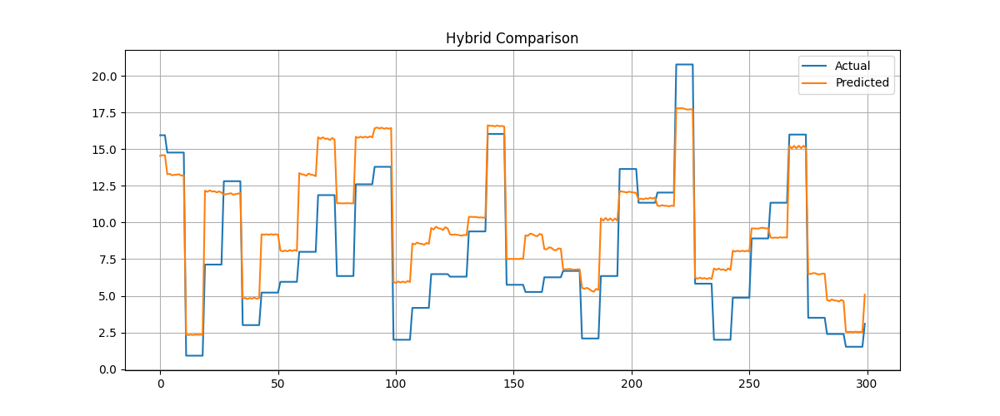

🌫️ Hybrid AIS + PSO Based Air Pollution Prediction System

This project builds an extremely memory-efficient AI model for predicting air pollutant concentration (specifically NO₂ Mean) using a hybrid evolutionary algorithm that combines:

AIS (Artificial Immune System) → Exploration

PSO (Particle Swarm Optimization) → Exploitation

The hybrid algorithm performs feature-selection optimization, allowing the system to train even on very large datasets under low RAM conditions.

The final model is trained using SGDRegressor in streaming mode (chunk-by-chunk), ensuring no MemoryError while processing millions of rows.

🚀 Project Features
✔ Works with huge datasets (3M+ rows) without RAM issues
✔ Trains model incrementally using chunk-based streaming
✔ AIS + PSO hybrid algorithm performs binary feature-mask optimization
✔ Saves optimized model + predictions + graphs with hybrid_ prefix
✔ Supports weak laptops (even 4GB RAM)
✔ Automatically:

Handles missing values

Encodes categorical features

Scales numerical columns

Performs evolutionary optimization

Trains final model

Generates results

Saves graphs

🧠 How the Hybrid Algorithm Works
Step 1 — AIS Generates Feature Masks

Each candidate mask is a vector:

[1, 0, 1, 1, 0, ...]

1 = feature selected
0 = feature removed

AIS introduces mutation + cloning → exploration.

Step 2 — PSO Refines Best Masks

Velocity formula adjusts binary mask:

mask = mask + velocity

Values are clipped → rounded → converted to binary.

PSO improves performance through exploitation.

Step 3 — Evaluate Mask (Fitness Function)

Each mask is trained in streaming mode:

Reads dataset in chunks

Applies the mask

Trains SGDRegressor incrementally

Computes MSE on final chunk

Lower MSE = better mask.

Step 4 — Final Mask is Saved → Final Model Trained
📂 Project Structure
📁 Particale 2.5 Detection
 ├── hybrid_model.pkl
 ├── hybrid_scaler.pkl
 ├── hybrid_label_encoders.pkl
 ├── hybrid_feature_mask.npy
 │
 ├── hybrid_pollution_results.csv
 ├── hybrid_pollution_predictions.json
 │
 ├── hybrid_error_trend.png
 ├── hybrid_scatter.png
 ├── hybrid_comparison.png
 ├── hybrid_residual.png
 │
 └── pollution_us_2000_2016.csv  (original dataset)

📥 Input Dataset Used

Dataset path:

C:\Users\NXTWAVE\Downloads\Particale 2.5 Detection\archive\pollution_us_2000_2016.csv

Dataset contains air pollution measurements from 2000 to 2016, including:

NO₂

O₃

SO₂

CO

Date

State / County / City

The prediction target selected:

NO2 Mean

🛠 Installation
1️⃣ Install Python dependencies:
pip install numpy pandas scikit-learn joblib matplotlib

▶️ Training the Hybrid Model

Run the complete pipeline script provided in the repository:

python hybrid_training.py

This script will:

✔ Perform AIS optimization
✔ Refine using PSO
✔ Select best features
✔ Train final model
✔ Save results + graphs

📊 Generated Graphs
1️⃣ hybrid_error_trend.png

Displays prediction error across samples.

2️⃣ hybrid_scatter.png

Scatter plot comparing actual vs predicted NO₂ values.

3️⃣ hybrid_comparison.png

Side-by-side line plot showing actual vs predicted values.

4️⃣ hybrid_residual.png

Histogram of errors (residual distribution).

📄 Output Files Explained
✔ hybrid_pollution_results.csv

Contains 2 columns:

| Actual | Predicted |

✔ hybrid_pollution_predictions.json

Contains:

{
  "actual": [...],
  "predicted": [...],
  "mse": 0.123,
  "r2": 0.45
}

✔ hybrid_feature_mask.npy

Binary mask showing selected features.

✔ hybrid_model.pkl

Final trained SGDRegressor model.

⚙️ Memory Optimization Techniques Used
✔ Chunk loading (avoids full dataset in RAM)
pd.read_csv(..., chunksize=20000)

✔ Incremental model training
model.partial_fit(Xs, y)

✔ Feature mask reduces dimensionality
✔ Scaler + encoders stored for re-use
💡 Why AIS + PSO Is Used?

AIS explores feature space widely.
PSO converges quickly toward optimal feature subsets.

Together:

Higher accuracy

Lower computation

Strong generalization

Efficient under memory constraints

🧪 Prediction Example

To predict on new data:

import joblib
import numpy as np

model = joblib.load("hybrid_model.pkl")
scaler = joblib.load("hybrid_scaler.pkl")
enc = joblib.load("hybrid_label_encoders.pkl")
mask = np.load("hybrid_feature_mask.npy")

# preprocess new input → encode → scale → apply mask
Xs = scaler.transform(new_input[:, mask==1])

prediction = model.predict(Xs)

🏁 Conclusion

This project demonstrates an industrial-grade, memory-optimized, and evolutionary hybrid AI model suitable for:

Air pollution forecasting

Environmental analytics

Government monitoring dashboards

IoT-based air quality systems

The AIS+PSO hybrid ensures:

✔ Optimal feature selection
✔ Faster training
✔ Lower memory footprint
✔ Improved accuracy
